# ECONOVA-S™ AI-to-AI Scientific Automation

## Purpose

The **AI-to-AI Scientific Automation Fabric™** is the governed runtime that coordinates specialized scientific agents across ECONOVA-S™. It is **not a third core**. It connects the Stable Economic Knowledge Core™ and Replaceable Technology Core™ through explicit, machine-readable scientific handoffs.

The objective is not to make AI an autonomous scientific authority. The objective is to make scientific work **modular, reviewable, reproducible, adversarial, verifiable, and stoppable**.

> **Generate → Ground → Critique → Rank → Execute → Evolve → Replicate → Falsify → Verify Evidence → Human Gate**

## Canonical discovery sequence

```mermaid
flowchart LR
    A[Research Goal] --> B[Literature Grounding]
    B --> C[Co-Scientist Hypothesis Tournament]
    C --> D[Theory & Causal DAG]
    D --> E[ERA Empirical Design]
    E --> F[Computational Discovery / AlphaEvolve]
    F --> G[Latent-Structure Analysis]
    G --> H[Independent Replicator]
    H --> I[Scientific Red-Team]
    I --> J[Science One Chain-of-Evidence]
    J --> K[CoE Audit]
    K --> L[Welfare Reviewer]
    L --> M[Evidence Passport™]
    M --> N{Human Gate™}
    N -->|Revise| C
    N -->|Proceed| O[Controlled Next Stage]
```



The full protocol is defined in [`GOOGLE_INSPIRED_DISCOVERY_PROTOCOL.md`](GOOGLE_INSPIRED_DISCOVERY_PROTOCOL.md).

## Co-Scientist-style role functions

The hypothesis layer uses distinct logical functions inspired by public descriptions of Google Research's AI co-scientist:

1. **Generation** — propose competing hypotheses/mechanisms.
2. **Reflection** — critique coherence, assumptions and novelty.
3. **Ranking** — compare candidates using frozen criteria.
4. **Evolution** — revise/recombine promising hypotheses.
5. **Proximity** — detect redundancy and conceptual distance.
6. **Meta-review** — summarize debate, uncertainty and surviving candidates.

The ranking system is a search device; it is not external validation.

## ERA-style empirical agent

The empirical-design agent must convert surviving hypotheses into executable tests with:

- authoritative data or clearly labelled simulation;
- Variable DNA™;
- chronology controls;
- estimand and identification class;
- code entry point;
- evaluation metrics;
- robustness/falsification plan;
- replication/OOS plan.

Prose alone is insufficient.

## AlphaEvolve / Computational Discovery agents

The search layer may evolve models, algorithms, constructs, measures, estimators, prompts or specifications using frozen evaluators.

Requirements:

- frozen scientific fitness;
- no p-value-only optimization;
- candidate lineage;
- immutable raw evaluator outputs;
- exploration/exploitation policy;
- separate DiscoverySystem and ValidationSystem where feasible;
- holdout leakage protection.

## AlphaFold-inspired latent-structure agent

This is an **inspiration layer**, not the biological AlphaFold system applied to economics. The agent searches for hidden economic structure such as latent factors, regimes, networks, risk dimensions or construct hierarchies, then requires:

- economic interpretation;
- simpler baseline comparison;
- stability testing;
- OOS/external validation where feasible;
- observable implications.

## Independent Replicator

Attempts to reconstruct the study from the Evidence Passport and documented artifacts without relying on the generator's hidden reasoning. Failure to reproduce is a first-class output and may stop downstream execution.

## Scientific Red-Team

Searches for:

- alternative explanations;
- leakage/look-ahead;
- p-hacking or evaluator gaming;
- construct drift;
- invalid identification;
- data-quality failures;
- method-code mismatch;
- unsupported causal language;
- omitted robustness/falsification tests.

## Science One Chain-of-Evidence Agent

Every material claim must carry a recorded evidence chain satisfying:

- **Completeness** — the claim has evidence;
- **Correctness** — the evidence actually supports the claim.

Claim evidence may point to verified literature, data hashes, code commits, run logs, tables, evaluator outputs, replication reports or red-team reports.

## CoE Audit Agent

Runs post-hoc integrity checks for:

1. reference verification;
2. score/result reproducibility;
3. specification integrity;
4. method-code alignment;
5. claim-evidence alignment.

A failed CoE Audit blocks discovery approval.

## Welfare & Economic Value Reviewer

Separates private value from social value and assesses economic magnitude, distribution, privacy, market power, environmental effects and other externalities where relevant.

## Evidence Passport™

Freezes provenance for the question, hypotheses, evidence, data, code, model/tool versions, assumptions, search lineage, results, contradictions, failures, robustness, replication, Chain-of-Evidence, CoE Audit and human decision.

## Human Gate™

No agent may self-authorize a scientific discovery.

```text
human_gate_required = true
human_gate_approved = false   # default
discovery_claim_allowed = false
```

## Machine-readable handoff contract

Every agent-to-agent message should contain:

```text
TaskID
RunID
Sender
Receiver
Claim
Evidence
Method
Assumptions
Confidence
Contradictions
FailureStatus
Provenance
ParentHash
IndependenceClass
RiskFlags
RequiredNextAction
ContentSHA256
```

Canonical schema:

`automation/ai_handoff.schema.json`

## Scientific independence rule

A review is not independent merely because a second prompt is used. Independence should be strengthened by one or more of:

- different model/model family;
- isolated context;
- separate data/code execution path;
- separate retrieval context;
- independent Evidence Passport reconstruction;
- frozen pre-analysis protocol;
- blinded benchmark/holdout;
- external human review.

```text
agent_consensus != scientific_truth
```

## Stop conditions

Automation must stop or route back to revision when:

- required evidence is missing;
- provenance cannot be verified;
- chronology/leakage checks fail;
- construct validity fails;
- causal identification is unsupported;
- evaluator leakage/gaming is detected;
- replication fails materially;
- red-team contradictions remain unresolved;
- robustness/falsification gates fail;
- Chain-of-Evidence is incomplete/incorrect;
- CoE Audit fails;
- welfare interpretation is materially incomplete where required;
- Human Gate does not approve progression.

## Routing rule

```text
IF literature_or_evidence_missing
    → Evidence Grounding Agent
ELSE IF hypothesis_unstable
    → Co-Scientist Tournament
ELSE IF construct_invalid
    → Variable DNA & Construct Agent
ELSE IF identification_invalid
    → Econometrics & Identification Agent
ELSE IF search_integrity_failed
    → Discovery Search Governance
ELSE IF replication_failed
    → Replicator + Generator disagreement loop
ELSE IF red_team_unresolved
    → Adversarial revision loop
ELSE IF chain_of_evidence_failed OR coe_audit_failed
    → Claim/Evidence reconciliation
ELSE
    → Evidence Passport → Human Gate
```

## Mirendil-inspired closed-loop improvement

Mirendil is not a Google product. ECONOVA-S™ uses Mirendil-inspired language only for the general R&D acceleration loop:

`Propose → Build → Execute → Evaluate → Diagnose → Revise → Re-run → Compare → Preserve Improvement`

Self-improvement cannot rewrite the scientific constitution: Human Gate, evidence classes, provenance, falsification, discovery criteria, security or licensing.

## GitHub automation

The repository contains:

- `.github/workflows/ai_to_ai_contract.yml` — validates handoff integrity and fault containment;
- `discovery/study_manifest.schema.json` — study-level discovery contract;
- `discovery/validate_study_manifest.py` — machine-enforced discovery gate;
- `discovery/test_discovery_manifest.py` — gate-bypass tests;
- `templates/STUDY_DISCOVERY_TEMPLATE.md` — publication-grade study template.

Live paid model execution remains a replaceable technology adapter and should use explicitly authorized secrets/configuration.

## Scientific boundary

Multiple AI agents may share blind spots, training priors, retrieval errors or evaluator weaknesses. Therefore:

```text
agent_consensus != scientific_truth
discovery_claim_allowed = false
```

until applicable literature, DAG, empirical, search-integrity, replication, adversarial, falsification, Chain-of-Evidence, CoE Audit, economic/welfare, reproducibility and Human Gate requirements are satisfied.
