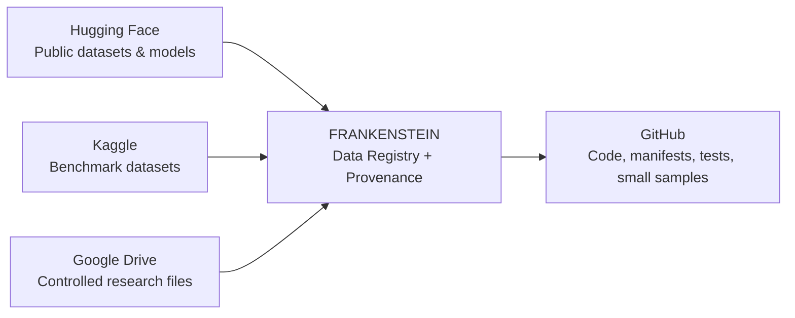
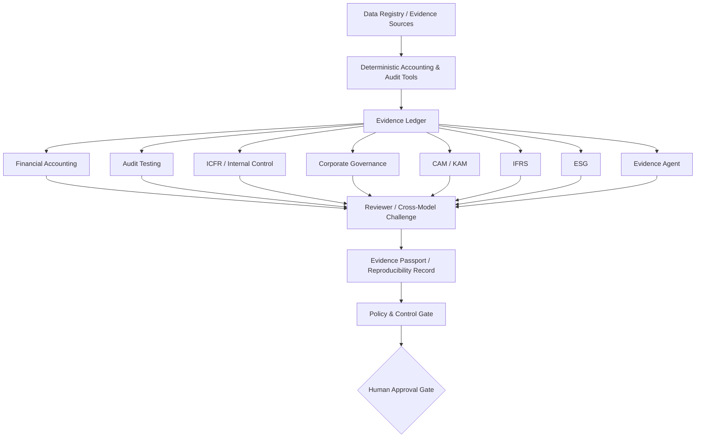

# FRANKENSTEIN™ Architecture

FRANKENSTEIN is the evidence-governed accounting, audit and assurance research orchestrator in this repository. The architecture is intentionally provider-neutral and separates **data**, **professional knowledge**, **deterministic tests**, **agents**, **verification**, and **human authority**.

## Data fabric



GitHub is **not** the primary warehouse for large datasets. It stores reproducible code, manifests, checksums, source locations, small demonstration samples and experiment outputs.

## Professional architecture



## Replaceable model/provider layer

The same workflow may be tested with GPT/Codex, Claude, Gemini, Microsoft/Azure-hosted models, Kimi, DeepSeek or local models. Changing the model must not silently change the accounting procedure, evidence packet or evaluation metric.

## Five-phase development

1. **Public data connection** — one free Hugging Face example.
2. **Registered data fabric** — Hugging Face + Kaggle + Google Drive + authoritative public sources.
3. **Specialist free/open agent layer** — accounting, audit, control, governance, IFRS and ESG.
4. **Cross-model benchmarking** — same case, multiple providers, frozen tools/evidence.
5. **Evidence-governed research platform** — provenance, challenge, reproducibility, control gates and human authority.

See [ROADMAP_5_PHASES.md](ROADMAP_5_PHASES.md).

## Invariants

1. Evidence precedes narrative.
2. Deterministic calculations precede generative interpretation where feasible.
3. Data source, license, version and retrieval time are recorded.
4. Large data stays in its appropriate data platform unless there is a documented reason to mirror it.
5. Missing evidence is surfaced, not invented.
6. Model-provider choice is replaceable.
7. Material professional conclusions require human approval.


## Phase 3 tool mapping

| Specialist capability | Approved open/research-accessible adapters |
|---|---|
| Financial accounting | FinanceSkills, CPA Skills, deterministic Python, authoritative sources |
| Audit testing | CPA Skills, Docling MCP, deterministic Python |
| Evidence | Docling MCP, SEC EDGAR MCP |
| ICFR/internal control | closegate, CPA Skills, deterministic Python |
| Corporate governance | SEC EDGAR MCP, Docling MCP |
| CAM | SEC EDGAR MCP, Docling MCP |
| KAM | Docling MCP |
| IFRS | FinanceSkills, deterministic Python, permitted authoritative sources |
| ESG | Docling MCP, AI4SustainableX with license review |
| Independent reviewer | deterministic checks, Docling MCP, authoritative sources |

The Orchestrator may route tasks but may not bypass evidence requirements, policy gates or Human Approval.


## Phase 4 benchmark architecture

```text
Frozen Case + Frozen Evidence + Frozen Output Schema
                     |
                     v
           Provider-neutral prompt
                     |
       +-------------+-------------+
       |             |             |
      GPT          Claude        Gemini
       |             |             |
 Microsoft/Azure    Kimi        DeepSeek
       +-------------+-------------+
                     |
                     v
              JSON normalization
                     |
                     v
         Deterministic eight-part scorer
                     |
                     v
      Results artifact + run metadata
```

The provider layer may change, but the case, evidence packet, temperature, scoring code and evaluation schema remain fixed.

A controlled live workflow attempt completed successfully at:
https://github.com/Saehon/Saeid-Homayoun/actions/runs/35991057487

No provider-performance result was produced because the required provider credentials/model variables were not configured. Missing providers were skipped explicitly.
