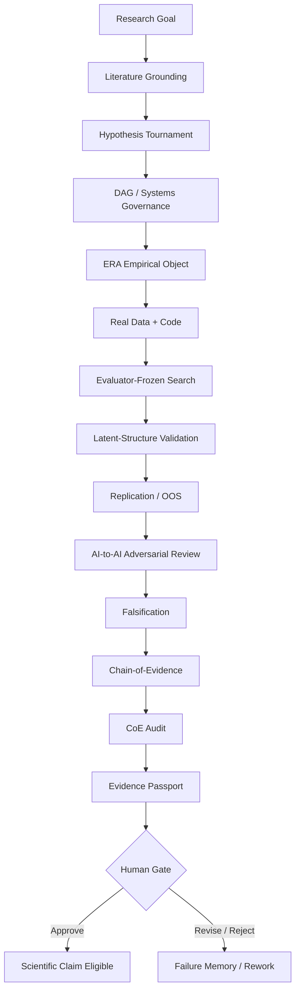

# NAAIL OpenLab™ Scientific Discovery Contract

**Status:** Canonical public research-governance specification  
**Scope:** NAAIL OpenLab™, ECONOVA-S™, and publication-grade studies in this repository  
**Authority:** Human reviewer; AI systems may propose, test, critique, rank, replicate, and falsify, but may not authorize a scientific-discovery claim.

## Core rule

> **Inspiration is not execution. Generation is not evidence. Agent agreement is not truth. Statistical significance is not discovery.**

NAAIL uses ideas inspired by leading AI-for-science systems while remaining an independent research program. A study may name an external method or system only as methodological inspiration unless the Evidence Passport records that the external system was actually executed, with version/provenance information and rights to use it.

## Scientific discovery stack

### 1. Co-Scientist-style Hypothesis Arena

Generate multiple competing hypotheses and mechanisms, then separate generation from reflection, ranking, evolution, proximity/redundancy analysis, and meta-review.

A surviving hypothesis must be falsifiable, theoretically grounded, empirically testable, feasible with identified data, and linked to a plausible contribution.

### 2. ERA-style Empirical Conversion

Convert each surviving hypothesis into an empirical object containing:

- authoritative or explicitly simulated data;
- Variable DNA™ and sample-construction rules;
- chronology and information-availability rules;
- estimand and identification strategy;
- executable code;
- prespecified evaluation metrics;
- robustness and falsification tests;
- replication/OOS plan;
- expected failure modes.

Prose without executable empirical design is not sufficient for publication-grade discovery status.

### 3. AlphaEvolve-inspired Scientific Search

Search may evolve code, algorithms, measures, estimators, model architectures, prompts, and specifications only against a **frozen scientific fitness function**.

The system must not optimize for p-values alone. Evaluators must be frozen before discovery search wherever feasible, and candidate lineage plus rejected/null results must be retained.

### 4. Computational Discovery

Candidate solutions should be generated and evaluated systematically rather than accepting the first plausible model. Discovery and validation contexts should be separated, with holdout information protected from the generator where feasible.

### 5. AlphaFold-inspired Latent-Structure Reasoning

AlphaFold is a biological system and is **not** treated as an economics/accounting model. NAAIL borrows the broader scientific idea of reasoning over difficult hidden structure and rigorous external benchmarking.

Candidate latent structures in business research may include hidden factors, regimes, firm types, risk dimensions, network structure, state transitions, or latent mechanisms. Such structures require interpretation, simpler baselines, stability testing, and OOS/external validation.

### 6. Science One-inspired Chain-of-Evidence + CoE Audit

Every material claim should resolve through a traceable chain:

`claim → literature/data → transformation → code → executed result → robustness/falsification → replication → interpretation → human decision`

CoE Audit checks at minimum:

- reference verification;
- numerical-result reproducibility;
- specification integrity;
- method/code alignment;
- claim/evidence alignment.

A failed CoE Audit blocks a scientific-discovery claim.

### 7. Mirendil-inspired Closed-Loop R&D

NAAIL uses Mirendil only as inspiration for accelerated closed-loop R&D:

`propose → build → execute → evaluate → diagnose failure → mutate/revise → re-run → compare → retain justified improvement`

The loop may improve scientific throughput and implementation quality. It may **not** weaken provenance, falsification, replication, holdout, licensing, or Human Gate requirements.

## Four-system separation

Publication-grade workflows should separate these logical responsibilities wherever feasible:

1. **Generator System** — proposes hypotheses, models, code, measures, and explanations.
2. **Evaluator System** — applies frozen metrics and benchmark rules.
3. **Validation System** — replicates, red-teams, falsifies, audits evidence, and checks leakage.
4. **Human Authority** — approves or rejects the final evidence class and any scientific-discovery claim.

Different prompts to the same model are only **role separation**, not strong independence. Stronger review can use isolated context, different model families, independent code paths, independent retrieval, blinded holdouts, clean-room replication, or external human review.

## Professional Decision DAG™



No node may silently upgrade its own evidence class. Failed gates stop or downgrade the workflow.

## Discovery state machine

| State | Minimum meaning | Claim allowed? |
|---|---|---:|
| `concept` | Research idea exists | No |
| `preregistered` | Question/protocol/metrics frozen | No |
| `executing` | Data/code/model runs underway | No |
| `validated` | Internal validation complete | No |
| `replicated` | Replication/OOS evidence recorded | No |
| `human_review` | Full evidence package under review | No |
| `approved` | Human Gate explicitly authorizes claim | Potentially, only if validator passes |

The default is always:

```text
discovery_claim_allowed = false
```

## Machine-enforced scientific controls

The repository contains an executable governance layer:

- `discovery/study_manifest.schema.json` — machine-readable study contract;
- `discovery/validate_study_manifest.py` — fail-closed governance validator;
- `discovery/test_discovery_manifest.py` — tests preventing Human Gate and evidence-class bypass;
- `discovery/scientific_constitution.json` — machine-readable scientific invariants;
- `.github/workflows/scientific_discovery_protocol.yml` — CI enforcement.

A discovery claim is blocked unless mandatory scientific gates, integrity controls, evidence artifacts, independent review conditions, and Human Gate requirements are satisfied.

## Non-negotiable invariants

```text
agent_consensus_is_scientific_truth = false
optimize_for_p_value = false
discovery_claim_default = false
human_gate_required = true
failed_and_null_results_must_be_retained = true
protocol_relaxation_by_agent_allowed = false
external_system_names_imply_execution = false
review_role_separation_alone_counts_as_independence = false
holdout_leakage_allowed = false
```

## Methodological provenance

Primary public methodological references:

- Google Research — AI co-scientist: https://research.google/blog/accelerating-scientific-breakthroughs-with-an-ai-co-scientist/
- Google Research — Empirical Research Assistance (ERA) and Computational Discovery: https://research.google/blog/empirical-research-assistance-era-from-nature-publication-to-catalyzing-computational-discovery/
- Google DeepMind — AlphaEvolve: https://deepmind.google/blog/alphaevolve-a-gemini-powered-coding-agent-for-designing-advanced-algorithms/
- Google DeepMind — AlphaFold: https://deepmind.google/science/alphafold/
- Google Research — Science One Framework / Chain-of-Evidence: https://research.google/blog/science-one-framework-a-verifiable-autonomous-research-framework-via-chain-of-evidence/
- Mirendil — autonomous/self-accelerating AI R&D: https://mirendil.com/

## Independence statement

NAAIL OpenLab™ and ECONOVA-S™ are independent research projects. References to Google, Google Research, Google DeepMind, Mirendil, OpenAI, Microsoft, professional-services firms, or other organizations indicate methodological inspiration, interoperability targets, public research references, provider options, or comparison classes only. They do not imply sponsorship, endorsement, partnership, employment, certification, or access to proprietary systems unless separately documented.
