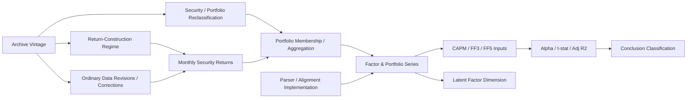

# 04 — Causal / Measurement DAG

## Governance interpretation

The archive vintage jointly indexes the documented construction regime and other possible archive maintenance channels. Therefore, the path

`Archive Vintage → Return-Construction Regime → Outcomes`

is **not isolated** from

`Archive Vintage → Ordinary Revisions / Reclassification → Outcomes`.

Accordingly, the primary evidence class is associational/measurement-stability evidence. The identification gate remains false for a pure CIZ causal effect.

## Measurement nodes

- Factor and portfolio returns are measured on the common calendar intersection.
- DCS summarizes absolute vintage differences.
- Conclusion Reversal summarizes changes in sign and/or a frozen 5% significance classification for the same model and sample.
- FDR controls are applied to pre-specified test families rather than used to search for significance.

## Falsifiers / negative controls

- Adjacent archive pairs within the same construction regime should be used as ordinary-revision placebos.
- Parser/alignment checks must reproduce identical values when the same archive is compared with itself.
- Alternative HAC lags must not redefine the primary conclusion after results are seen.
- Reduced-rank factor-dimension findings require separate validation before interpretation.

## Evidence-class rule

No regression coefficient, fixed effect, HAC standard error, or significance result can upgrade this DAG to causal identification by itself.
